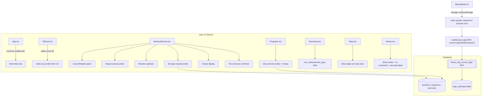

# Design Document — FitnessTracker V8

## Overview

V8 is a maintenance-and-enhancement release of the FitnessTracker PWA V2 (`pwa-v2/`, React 18 + TypeScript + Vite + Supabase). It bundles fifteen improvements across five themes:

1. **Visual redesign** — adopt the `pwa-v2/2.0/` reference look and remove the 3D mouse-tracking tilt animation (Req 1, 2, 4).
2. **Workout ergonomics** — usual-weights panel, exercise swap, exercise reorder, tempo display, reps/seconds set types (Req 3, 7, 8, 11, 13).
3. **Data-model corrections** — max single-set reps metric, taille label verification, reviewable comments (Req 9, 10, 12).
4. **Security hardening** — session storage that clears at browser end, server-authoritative brute-force protection (Req 5, 6).
5. **Repository & documentation** — private GitHub instructions, V8 documentation + changelog (Req 14, 15).

This design is grounded in the current source. Where the current code already satisfies a requirement or diverges from an assumption, this document flags it explicitly (see **Grounding notes / mismatches** below).

### Grounding notes / mismatches found in current code

These were discovered while reading the actual source and directly shape the design:

- **Req 4 (bottom nav)** — The requirement says remove "Programme" and "Accueil" buttons. The actual `mobile-nav` in `App.tsx` currently renders **five** buttons: `dashboard` (labeled "Accueil"), `programs` ("Prog."), `history` ("Histo."), `mensuration` ("Mensur."), `exercises` ("Exos"). The locked interpretation is: **remove the entire `mobile-nav` bar and keep only the `home-fab`**, matching Req 4.1/4.2/4.4 ("no navigation buttons remain in the Mobile_Nav"). The sidebar remains the full navigation surface.
- **Req 9 (taille label)** — `Mensurations.tsx` **already** labels the height field "Taille" (stored in `taille`) and the waist field "Tour de taille" (stored in `tour_taille`) as two distinct `FIELDS` entries, saved independently. **This requirement is already satisfied in code.** V8 work here is verification + a regression test + documentation; no functional change is required unless verification reveals a defect.
- **Req 12 (reviewable comments)** — Sessions are saved with `notes` (session-level comment) in `WorkoutScreen.handleSave`. `History.tsx` loads `notes` into its `SessionData` type but the **expanded detail view never renders `notes`**. There is currently **no per-exercise comment field** in the `WorkoutExercise`/save model. So: session notes need to be *displayed* (gap), and per-exercise comments need to be *added end-to-end* (new).
- **Req 13 (tempo)** — There is **no in-app editor to add or edit exercises inside a program day**. `Programs.tsx` only creates a program shell (name + goal + empty `days: []`) and lists existing days read-only; `DefaultPrograms.tsx` copies pre-authored programs. Program days are effectively authored only via the default-program templates. To satisfy Req 13 ("WHEN a user configures a Program_Exercise…"), V8 must add a **program-day exercise editor** in `Programs.tsx` that includes the tempo field, and add `tempo` to the default-program templates. This is a larger change than a single field and is flagged as such.
- **Req 10 (max reps)** — `Stats.tsx` currently shows only "Charge max" (max weight per session) and weight-based personal records. There is **no reps metric at all**; "cumulative reps sum" is not currently displayed either. So Req 10 is an **addition** (add a max-single-set-reps view), and Req 10.2 ("SHALL NOT display sum of reps") is satisfied by construction.
- **`repsTarget` type drift** — `Programs.tsx` types `repsTarget: number`, while `Home.tsx` and `DefaultPrograms.tsx` type it `string` (e.g. "8-12"). The default data uses strings. V8 standardizes on **`string`** (ranges like "8-12" must be supported). This is corrected as part of the Programs editor work.
- **Req 11 (reps/seconds)** — `History.tsx`'s set type already tolerates an optional `duration?: string` field and renders `${st.duration}` when weight is absent. This is the anchor for the seconds path; the missing pieces are the exercise-level `set_measurement_type`, the workout capture UI, and consistent labeling.

## Architecture

### Current architecture (as-is)

```
main.tsx  → registers SW, mounts <App/>
App.tsx   → auth gate (Supabase), theme state (dark/light/stitch/girly),
            sidebar + topbar + mobile-nav + home-fab, page router (switch),
            hosts <WorkoutScreen/> overlay via workoutState
lib/supabase.ts → createClient(URL, ANON_KEY)   (default persistence = localStorage)
components/
  TiltCard.tsx    → 3D mouse-tracking tilt (to be replaced with static lift)
  WorkoutScreen.tsx → active session overlay; sets = {weight,reps,rpe,done,restLeft,restPaused}
  Icons.tsx, Mannequin.tsx, StoryExport.tsx
pages/
  Home, Dashboard, Programs, History, Stats, Exercises,
  Mensurations, Cardio, Report, Updates, Profile, DefaultPrograms
```

Data lives in Supabase tables: `exercises`, `programs` (with `days` jsonb), `sessions` (with `exercises` jsonb + `notes`), `mensurations`.

### V8 architectural changes (by area)



### Component / file change map

| File | Change | Requirements |
|------|--------|--------------|
| `src/index.css` | Port 2.0 stylesheet: `body::before/after` sporty gradient, static `.tilt-card:hover { transform: translateY(-3px) }` + neon glow, `.home-card` static hover; **keep** the four theme blocks (`light`/`stitch`/`girly` + default) | 1 |
| `src/components/TiltCard.tsx` | Remove mouse-tracking state (`tilt`, `shine`, `onMove`, inline `perspective/rotate` transform). Render a plain `div.tilt-card` (as in 2.0) | 1 |
| `src/App.tsx` | Remove the `<nav className="mobile-nav">` block; keep `home-fab` | 4 |
| `src/pages/Home.tsx` | Shrink the day-session tile (new `.home-day-session` compact styles) | 2 |
| `src/components/WorkoutScreen.tsx` | Add usual-weights panel, swap picker, reorder controls, set-type handling (reps vs seconds), tempo display, per-exercise comment; extend save payload | 3, 7, 8, 11, 12, 13 |
| `src/pages/Exercises.tsx` | Add `set_measurement_type` select to create/edit form; persist to `exercises` | 11 |
| `src/pages/Programs.tsx` | Add day/exercise editor including free-text `tempo`; standardize `repsTarget: string` | 13 |
| `src/pages/DefaultPrograms.tsx` | Add optional `tempo` to `ProgramExercise` type/templates | 13 |
| `src/pages/Stats.tsx` | Add "Reps max (série)" metric per exercise over selected period | 10 |
| `src/pages/History.tsx` | Render session `notes`, per-exercise comments, and label seconds sets as duration | 11, 12 |
| `src/pages/Mensurations.tsx` | Verify only (already correct); add regression test | 9 |
| `src/pages/Updates.tsx` | Add V8 changelog block | 15 |
| `lib/supabase.ts` | Configure client `auth.storage = window.sessionStorage`, `persistSession: true`, `autoRefreshToken: true` | 5 |
| Supabase (SQL) | `login_attempts` table + `check_and_record_login` / `record_login_success` RPCs | 6 |
| `docs/` + `update/` | V8 documentation + changelog; GitHub-private instructions | 14, 15 |

### Session persistence configuration (Req 5) — LOCKED

The Supabase client currently uses the default persistence (browser `localStorage`), which keeps the session indefinitely. V8 reconfigures it to use `window.sessionStorage`, which the browser clears when the browser session ends (all tabs of the origin closed). This means the user must re-authenticate on the next visit after closing the browser.

```ts
// src/lib/supabase.ts
import { createClient } from '@supabase/supabase-js'

const SUPABASE_URL = 'https://hxlhdgfxusckralcjhbw.supabase.co'
const SUPABASE_KEY = '...anon key...'

export const supabase = createClient(SUPABASE_URL, SUPABASE_KEY, {
  auth: {
    // sessionStorage is cleared when the browser session ends → no permanent token (Req 5.1, 5.2, 5.3)
    storage: window.sessionStorage,
    persistSession: true,      // still restore within the same browser session
    autoRefreshToken: true,
    detectSessionInUrl: true,  // keep PASSWORD_RECOVERY / magic-link handling working
  },
})
```

Notes / consequences:
- `App.tsx`'s existing `getSession()` + `onAuthStateChange` flow is unchanged — it simply reads from the new storage.
- The app keeps a separate `localStorage` key `ft_active_workout` for in-progress workout recovery and `ft_theme` for theme. Those are **not** auth tokens and remain in `localStorage` (unaffected by Req 5, which targets the Auth_Session token specifically). This is called out because closing the browser will now require re-login but will *not* wipe an in-progress workout draft.
- Req 5.4 (limit third-party readability): using `sessionStorage` (same-origin, cleared on close) rather than a long-lived `localStorage` token reduces the exposure window. No token is placed in a cookie readable cross-site. The anon key remains a public client key (by Supabase design) and is not the Auth_Session.

### Brute-force protection (Req 6) — LOCKED, server-authoritative

Throttling must be **non-bypassable**, so the counter and lock live in Postgres (Supabase), not the client. The client cannot be trusted to enforce a lockout. A `SECURITY DEFINER` RPC owns all reads/writes to the throttle table; the browser only calls the RPC and reacts to its verdict.

#### Table DDL

```sql
create table if not exists public.login_attempts (
  identifier      text primary key,          -- normalized (lowercased/trimmed) email
  attempt_count   integer not null default 0,
  last_attempt_at timestamptz not null default now(),
  locked_until    timestamptz                -- null when not locked
);

-- No public/anon table access; the RPC (SECURITY DEFINER) is the only entry point.
alter table public.login_attempts enable row level security;
-- (no policies added → table is not directly selectable/updatable by anon/auth roles)
```

Configured constants (in the RPC): `MAX_ATTEMPTS = 5`, `LOCK_WINDOW = interval '15 minutes'`.

#### RPC: pre-login gate + failure recording

```sql
-- Returns a verdict the client uses to decide whether to attempt sign-in
-- and, on failure, to record the attempt. Runs as owner (SECURITY DEFINER).
create or replace function public.check_login_gate(p_identifier text)
returns table (blocked boolean, locked_until timestamptz, attempts_left integer)
language plpgsql
security definer
set search_path = public
as $$
declare
  v_id text := lower(trim(p_identifier));
  v_row public.login_attempts;
  c_max constant integer := 5;
  c_window constant interval := interval '15 minutes';
begin
  select * into v_row from public.login_attempts where identifier = v_id;

  -- expire an old lock automatically (Req 6.5)
  if v_row.identifier is not null
     and v_row.locked_until is not null
     and v_row.locked_until <= now() then
    update public.login_attempts
       set attempt_count = 0, locked_until = null, last_attempt_at = now()
     where identifier = v_id
     returning * into v_row;
  end if;

  if v_row.locked_until is not null and v_row.locked_until > now() then
    return query select true, v_row.locked_until, 0;   -- still blocked (Req 6.2, 6.4)
  else
    return query select false, null::timestamptz,
                        c_max - coalesce(v_row.attempt_count, 0);
  end if;
end;
$$;

-- Record a FAILED attempt (Req 6.1) and lock when threshold reached (Req 6.2)
create or replace function public.record_login_failure(p_identifier text)
returns table (blocked boolean, locked_until timestamptz)
language plpgsql
security definer
set search_path = public
as $$
declare
  v_id text := lower(trim(p_identifier));
  v_count integer;
  v_locked timestamptz;
  c_max constant integer := 5;
  c_window constant interval := interval '15 minutes';
begin
  insert into public.login_attempts (identifier, attempt_count, last_attempt_at)
  values (v_id, 1, now())
  on conflict (identifier) do update
    set attempt_count = public.login_attempts.attempt_count + 1,
        last_attempt_at = now()
  returning attempt_count into v_count;

  if v_count >= c_max then
    v_locked := now() + c_window;
    update public.login_attempts set locked_until = v_locked where identifier = v_id;
    return query select true, v_locked;
  end if;
  return query select false, null::timestamptz;
end;
$$;

-- Reset on SUCCESS (Req 6.3)
create or replace function public.record_login_success(p_identifier text)
returns void
language plpgsql
security definer
set search_path = public
as $$
begin
  delete from public.login_attempts where identifier = lower(trim(p_identifier));
end;
$$;

-- Allow the browser (anon + authenticated) to call only the RPCs
grant execute on function public.check_login_gate(text)     to anon, authenticated;
grant execute on function public.record_login_failure(text) to anon, authenticated;
grant execute on function public.record_login_success(text) to anon, authenticated;
```

Free-tier note: this is a single small table plus three PL/pgSQL functions — well within the Supabase free tier (no extensions, no scheduled jobs). Lock expiry is lazy (checked on the next `check_login_gate` call), so no cron is needed.

#### Client flow (`AuthScreen.handleSubmit` in `App.tsx`)

```
1. identifier = email (client also lowercases/trims for the message; RPC re-normalizes)
2. { blocked, locked_until } = await rpc('check_login_gate', { p_identifier: identifier })
3. if blocked → show "Trop de tentatives. Réessaie après <heure>." ; STOP (Req 6.2, 6.4)
4. { error } = await supabase.auth.signInWithPassword({ email, password })
5. if error (bad credentials):
       { blocked, locked_until } = await rpc('record_login_failure', { p_identifier: identifier })  (Req 6.1)
       if blocked → show blocked message (Req 6.4) else show credential error
6. if success:
       await rpc('record_login_success', { p_identifier: identifier })  (Req 6.3)
```

Because the gate is checked server-side *before* every sign-in and the lock lives in the DB, disabling client JS or replaying requests cannot bypass the lockout: an attacker calling `signInWithPassword` directly still fails on bad credentials, and each failure they *do* record increments the server counter; the app refuses to proceed while `check_login_gate` reports blocked. (Supabase also applies its own IP-level auth rate limits as defense in depth.)

## Components and Interfaces

### TiltCard (Req 1)

```ts
// Same public API — children/className/style — but no motion logic.
export function TiltCard({ children, className = '', style = {} }:
  { children: React.ReactNode; className?: string; style?: React.CSSProperties }) {
  return <div className={`tilt-card ${className}`} style={style}>{children}</div>
}
```
All hover motion moves to CSS (`.tilt-card:hover { transform: translateY(-3px); box-shadow: …; }`), matching `pwa-v2/2.0/src/index.css`. No `onMouseMove` / `perspective(...) rotateX/rotateY`. The `.card-shine` div is dropped (2.0 uses a `::after` top-edge line instead).

### WorkoutScreen — extended types (Req 3, 7, 8, 11, 12, 13)

```ts
export interface WorkoutSet {
  weight: string
  reps: string          // used when measurementType === 'reps'
  duration: string      // NEW: seconds value, used when measurementType === 'seconds' (Req 11)
  rpe: string
  done: boolean
  restLeft: number
  restPaused: boolean
}

export interface WorkoutExercise {
  name: string
  muscle: string
  restSec: number
  completed: boolean
  measurementType: 'reps' | 'seconds'   // NEW (Req 11) — defaulted from exercise.set_measurement_type
  tempo?: string                        // NEW (Req 13) — free text from program exercise
  comment?: string                      // NEW (Req 12) — per-exercise note
  sets: WorkoutSet[]
}
```

New UI controls, all in the exercise header row (small icon buttons):

- **Usual weights** (Req 3): a clock/history icon button per exercise header. Toggles `usualOpen: string | null` keyed by `exIdx`. When opened it calls `queryUsualWeights(exercise.name)` (see Data Models) and renders a dismissible panel modeled on the 2.0 "Dernière séance" panel. Because it queries by the exercise's **current `name`**, editing/swapping the name and reopening re-queries the new name (Req 3.4). Empty → "Aucun historique pour cet exercice." (Req 3.5). A close control hides it (Req 3.6).
- **Replace / swap** (Req 7): a swap icon button opens a picker modal listing `exercises` library rows (reuse the muscle-chip + search pattern from `Exercises.tsx`). Selecting a row sets `ex.name` and `ex.muscle` in place (Req 7.3, 7.4), preserving that exercise's `sets`. The recap and save read the current `name`/`muscle`, so the swap is reflected (Req 7.5, 7.6). After swap, an open usual-weights panel re-queries (Req 3.4 tie-in).
- **Reorder** (Req 8): up/down chevron buttons per exercise (disabled at ends). They swap adjacent entries in the `exercises` array via `structuredClone`, preserving each exercise's full object (sets, entered values, `completed`) (Req 8.2, 8.3). The save maps `exercises` in current order (Req 8.4).
- **Set-type input** (Req 11): when `measurementType === 'seconds'`, the reps column renders a seconds input labeled "s" and `adjustValue`/`updateSet` operate on `duration` instead of `reps`. When `'reps'`, behavior is unchanged.
- **Tempo** (Req 13): when `ex.tempo` is truthy, a small chip "Tempo: {tempo}" is shown under the exercise name; omitted otherwise (Req 13.4, 13.5).
- **Per-exercise comment** (Req 12): a small note field per exercise (collapsible) writing `ex.comment`.

### Programs day/exercise editor (Req 13)

A new expandable editor inside each program card in `Programs.tsx`:
- Add/remove days; per day add/remove exercises.
- Per exercise fields: `name` (from library or free text), `muscle`, `sets` (number), `repsTarget` (string), `restSec` (number), and **`tempo` (free text, optional)** (Req 13.1–13.3).
- Saves the whole `days` jsonb back to `programs`.

### Stats — max reps (Req 10)

Add a second metric card next to "Charge max": **"Reps max (série)"**. For the selected exercise and period, compute the maximum single-set `reps` across all sessions (never a sum) and plot it with the existing `SimpleLineChart`; also show a headline number. If no reps in the period → "Aucune donnée de répétitions." (Req 10.4).

### History — comments + seconds (Req 11, 12)

In the expanded detail:
- Render `s.notes` in an italic "Commentaire" block; if absent → "Aucun commentaire enregistré." (Req 12.1, 12.4).
- Render each exercise's `comment` when present (Req 12.2).
- For a set, when `st.duration` is present (and no weight/reps), label it "{duration}s" rather than reps (Req 11.6).

## Data Models

### `exercises` table — add column (Req 11)

```sql
alter table public.exercises
  add column if not exists set_measurement_type text not null default 'reps'
  check (set_measurement_type in ('reps','seconds'));
```
`Exercises.tsx` create/edit form gains a select (Reps / Secondes). Existing rows default to `'reps'` (backward compatible).

### `programs.days` jsonb — add `tempo` (Req 13)

Program exercise shape becomes:
```ts
interface ProgramExercise {
  id: string
  name: string
  muscle: string
  sets: number
  repsTarget: string     // standardized to string ("8-12")
  restSec: number
  tempo?: string         // NEW, free text, optional (Req 13)
}
```
Stored inside the existing `programs.days` jsonb; no schema migration needed (jsonb is schemaless). When starting a workout, `Programs.tsx` maps `ex.tempo` → `WorkoutExercise.tempo` and the exercise's `set_measurement_type` (looked up from the library by name) → `WorkoutExercise.measurementType`.

### `sessions.exercises` jsonb — extended (Req 7, 8, 11, 12)

Save payload per exercise becomes:
```ts
{
  name: string,                 // reflects swap (Req 7.5) and order (Req 8.4)
  muscle: string,               // reflects swap (Req 7.4)
  measurementType: 'reps'|'seconds',   // (Req 11.5)
  comment?: string,             // per-exercise note (Req 12)
  sets: Array<
    | { weight: string; reps: string; rpe: string }         // reps type
    | { weight: string; duration: string; rpe: string }     // seconds type (Req 11.5)
  >
}
```
`notes` (session-level comment) is already saved and remains. History's existing `duration?: string` set field is the read anchor.

### Usual-weights query (Req 3)

```ts
async function queryUsualWeights(name: string): Promise<{ date: string; weight: string; reps?: string; duration?: string }[]> {
  const { data: { user } } = await supabase.auth.getUser()
  if (!user) return []
  const { data } = await supabase
    .from('sessions')
    .select('date, exercises')
    .eq('user_id', user.id)
    .order('date', { ascending: false })
    .limit(30)
  const out: { date: string; weight: string; reps?: string; duration?: string }[] = []
  for (const s of data ?? []) {
    for (const ex of (s.exercises ?? [])) {
      if (ex.name === name) {                    // keyed on current exercise NAME (Req 3.2)
        for (const st of (ex.sets ?? [])) {
          out.push({ date: s.date, weight: st.weight ?? '', reps: st.reps, duration: st.duration })
        }
      }
    }
  }
  return out                                     // [] → panel shows "no history" (Req 3.5)
}
```

### `login_attempts` — see Architecture / Brute-force (Req 6).

### Mensurations (Req 9)

No model change. Existing columns `taille` (height) and `tour_taille` (waist) already coexist and are written from distinct `FIELDS` entries. Verification confirms no overwrite in `handleSubmit` (it builds a `payload` object keyed by field key, so `taille` and `tour_taille` never collide).

## Correctness Properties

*A property is a characteristic or behavior that should hold true across all valid executions of a system — essentially, a formal statement about what the system should do. Properties serve as the bridge between human-readable specifications and machine-verifiable correctness guarantees.*

Only the input-varying, logic-bearing acceptance criteria are expressed as properties below. Purely visual/layout criteria (Req 1 styling, Req 2 sizing, Req 4 button presence, Req 14/15 documentation) and one-time configuration checks (Req 5 storage config) are covered by example, snapshot, or smoke tests in the Testing Strategy, not by properties.

### Property 1: Day-session tile renders session name and all exercise names

*For any* program day with a name and a list of exercise names, the rendered compact Day_Session_Tile output contains the day/session name and contains every exercise name in the list.

**Validates: Requirements 2.2**

### Property 2: Usual-weights query is filtered by exercise name

*For any* session history and *any* exercise name, every set returned by `queryUsualWeights(name)` originates from an exercise recorded under exactly that name, and no set recorded under a different name appears; when no exercise in history matches the name, the result is empty.

**Validates: Requirements 3.2, 3.3, 3.4, 3.5**

### Property 3: Exercise swap updates name and muscle and is reflected on save

*For any* workout exercise and *any* replacement chosen from the library, applying the swap sets the exercise's name and muscle to the replacement's name and muscle while leaving that exercise's sets and entered values unchanged, and the save payload built afterward carries the replacement's name and muscle.

**Validates: Requirements 7.3, 7.4, 7.5, 7.6**

### Property 4: Reordering is an order-only permutation that preserves exercise data and is saved in order

*For any* list of workout exercises and *any* valid up/down move, the resulting list is a permutation of the original with only adjacent positions swapped: the collection of exercise objects (each with its sets, entered values, and completion state) is unchanged, and the save payload lists exercises in the current displayed order.

**Validates: Requirements 8.2, 8.3, 8.4**

### Property 5: Measurement value payload keeps taille and tour_taille independent

*For any* height value and *any* waist value entered in the Mensurations form, the built save payload stores the height under `taille` and the waist under `tour_taille` independently, so neither value overwrites the other.

**Validates: Requirements 9.3**

### Property 6: Progress reps metric is the maximum single-set reps over the period

*For any* set of sessions containing an exercise within the selected period, the computed repetition metric equals the maximum reps recorded in any single set of that exercise within the period, and is therefore greater than or equal to every individual set's reps and never equals the sum of reps across sets when more than one nonzero set exists.

**Validates: Requirements 10.1, 10.2, 10.3**

### Property 7: Set measurement type routes the value to duration or reps end to end

*For any* exercise, when its measurement type is `seconds` a captured set value is stored in the set's `duration` field (with `reps` empty) and, after save then reload, is displayed labeled as seconds; when its measurement type is `reps` the value is stored in `reps` (with `duration` empty) and displayed as reps.

**Validates: Requirements 11.4, 11.5, 11.6**

### Property 8: Session and per-exercise comments round-trip through persistence

*For any* session note text and *any* set of per-exercise comment texts, building the save payload then reading it back yields the same session note and the same per-exercise comments unchanged.

**Validates: Requirements 12.3**

### Property 9: History detail displays every stored comment

*For any* saved session, the rendered history detail contains the session note text (when present) and contains each exercise's comment text (when present).

**Validates: Requirements 12.1, 12.2**

### Property 10: Program exercise tempo round-trips as free text

*For any* tempo string, including the empty string, saving a program with that tempo on an exercise and reloading the program yields the exact same tempo value.

**Validates: Requirements 13.2, 13.3**

### Property 11: Tempo is displayed exactly when present

*For any* program exercise, starting a workout carries its tempo into the workout exercise, and the workout renders a tempo indicator containing that value if and only if the tempo is a non-empty string.

**Validates: Requirements 13.4, 13.5**

### Property 12: A failed login increments the attempt counter by one

*For any* identifier with a current failed-attempt count below the threshold, recording one failed login via the server gate increases that identifier's stored `attempt_count` by exactly one.

**Validates: Requirements 6.1**

### Property 13: Reaching the threshold blocks further attempts within the window

*For any* identifier, once the number of recorded failed attempts reaches the configured threshold, the login gate reports the identifier as blocked with a `locked_until` timestamp in the future for the duration of the lockout window.

**Validates: Requirements 6.2**

### Property 14: A successful login resets the counter

*For any* identifier with any failed-attempt count below the lock threshold, recording a successful login clears the counter so that a subsequent gate check reports the identifier as not blocked with the full number of attempts available.

**Validates: Requirements 6.3**

### Property 15: The lock is released after the window elapses

*For any* locked identifier, once the current time passes `locked_until`, the next gate check reports the identifier as not blocked and its counter reset, allowing login attempts again.

**Validates: Requirements 6.5**

## Error Handling

- **Supabase auth/RPC failures (Req 6)**: If `check_login_gate` errors (network/DB), the client treats the gate as *open but degraded* — it still attempts sign-in (so a transient DB error never permanently locks out a legitimate user) and surfaces a non-blocking toast; it does not silently swallow. `record_login_failure`/`record_login_success` failures are logged and retried once, best-effort, so a throttle write failure cannot crash the login flow. (Availability is preserved; the server gate remains authoritative when reachable.)
- **Session query failures (Req 3, 10)**: `queryUsualWeights` and Stats aggregation catch query errors and return empty results, which drive the existing "no history"/"no data" messages rather than throwing.
- **Malformed jsonb (Req 11, 13)**: Reading `sessions.exercises` / `programs.days` uses defensive defaults (`?? []`, `?? ''`) so legacy rows lacking `measurementType`/`tempo`/`duration` degrade to `reps`/absent without error (backward compatibility).
- **Swap/reorder guards (Req 7, 8)**: Reorder buttons are disabled at list ends; swap requires a selected library row before applying. All mutations use `structuredClone` to avoid shared-reference corruption of set state.
- **Auth session cleared mid-use (Req 5)**: If `sessionStorage` is cleared (browser end / manual), `onAuthStateChange` fires `SIGNED_OUT` and `App.tsx` returns to `AuthScreen`; an in-progress workout draft remains in `localStorage` for recovery after re-login.
- **Empty/whitespace inputs**: Numeric set inputs coerce via `parseFloat/parseInt` with `|| 0`; empty tempo is valid (Req 13.2).

## Testing Strategy

### Framework and libraries

- **Test runner**: Vitest (native to the Vite toolchain).
- **Component/DOM tests**: `@testing-library/react` + `jsdom`.
- **Property-based testing**: `fast-check` (the standard PBT library for TypeScript). Property tests must **not** be hand-rolled; use `fast-check` generators (`fc.array`, `fc.record`, `fc.string`, `fc.integer`, `fc.constantFrom`, etc.).
- **Supabase in tests**: the client and RPCs are mocked for unit/property tests. Property 12–15 (throttle) are validated against a **faithful in-memory model of the RPC logic** (same increment/threshold/window/reset rules) so 100+ iterations stay fast and free-tier-safe; a small number of **integration tests** exercise the real RPC against a Supabase test project to confirm the model matches server behavior. Throttle time-based properties (13, 15) use an **injected clock** so the lockout window is deterministic.

### Dual approach

- **Unit / example tests** cover: TiltCard has no rotation transform and ignores `mousemove` (Req 1.3, 1.5); index.css contains the 2.0 gradient/hover rules (Req 1.4 snapshot); Home compact tile snapshot (Req 2.1, 2.4); mobile-nav absent + FAB present (Req 4.1–4.4); usual-weights panel open/close (Req 3.1, 3.6); library picker shown (Req 7.1, 7.2); reorder controls disabled at ends (Req 8.1); Exercises set-type select present (Req 11.1); tempo field present (Req 13.1); blocked-message rendering (Req 6.4); "no data"/"no comment"/"no history" edge messages (Req 3.5, 10.4, 12.4).
- **Smoke tests** cover: Supabase client `auth.storage === window.sessionStorage` (Req 5.1, 5.2); cleared `sessionStorage` ⇒ `getSession()` null (Req 5.3 integration).
- **Property tests** implement Properties 1–15, one property-based test each.

### Property test configuration

- Each property test runs a **minimum of 100 iterations** (`fc.assert(fc.property(...), { numRuns: 100 })`).
- Each property test is tagged with a comment referencing its design property, using the format:
  `// Feature: v8-fitnesstracker, Property N: <property text>`
- One property is validated by exactly one property-based test.

### Documentation & repository (Req 14, 15)

Non-code verification: reviewer checklist confirming `docs/` (and the `update/V8FitnessTracker.md` release note + in-app `Updates.tsx` block + `docs/changelog.html`) describe the design/animation change, workout enhancements, data-model changes (`set_measurement_type`, `tempo`, taille), and security changes, and that GitHub-private instructions + consequences (Cloudflare Pages deployment of pwa-v1 on fitnesstracker.bzh must keep working; making the repo private does not affect the deployed site, only source visibility) are present.
